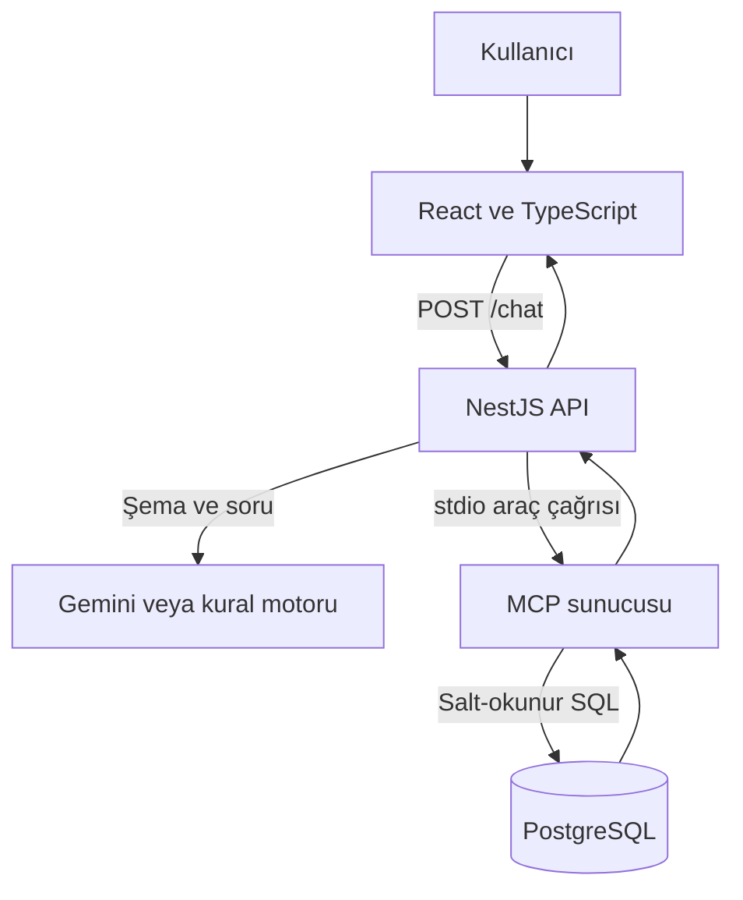
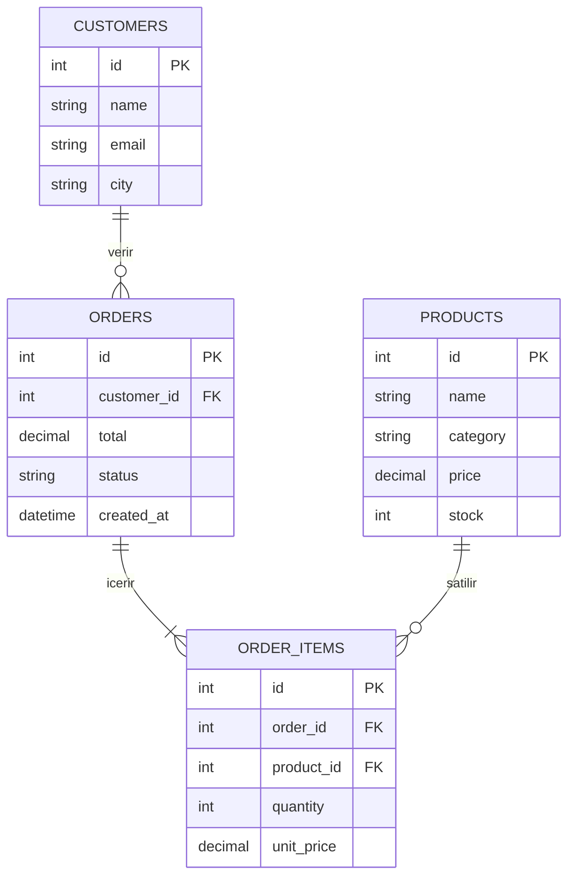
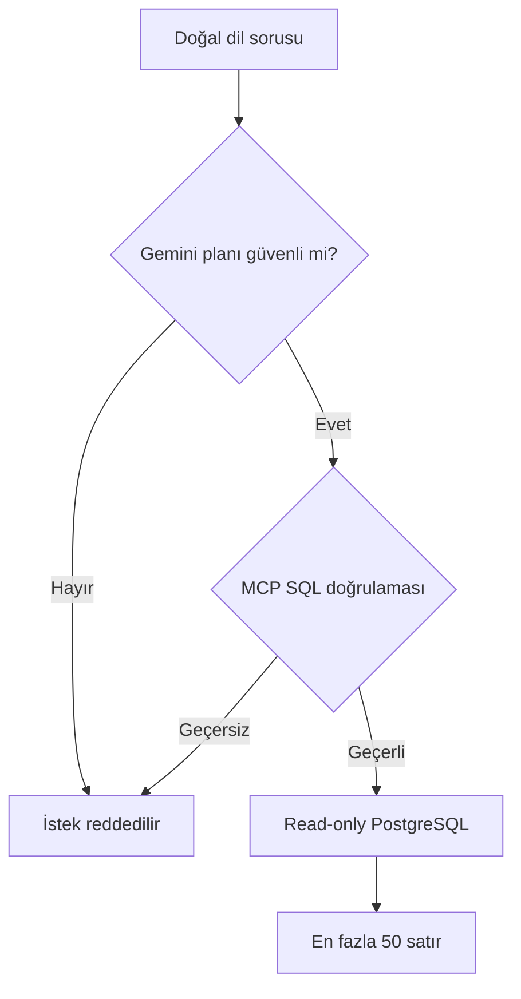

# Sistem Mimarisi

## Genel akış

Gemini yalnızca SQL planı üretir; veritabanına bağlanmaz. NestJS de SQL'i doğrudan PostgreSQL'e göndermez. Veritabanı erişimi yalnızca MCP sunucusundaki `query_database` aracı üzerinden gerçekleşir.

## Bileşen sorumlulukları

| Katman | Sorumluluk |
| --- | --- |
| React + TypeScript | Soruyu alma, bağlantı durumunu gösterme, kullanıcıya özel sohbet/favori akışı, KPI/grafik/tablo üretme, CSV indirme ve SQL kopyalama |
| NestJS | Kimlik ve oturum, RBAC, IP rate limit, doğrulanmış metrik sürümleme, Gemini isteği, çevrimdışı planlayıcı, MCP istemciliği, denetim kaydı ve Swagger |
| Gemini 3.1 Flash-Lite | Doğal dil sorusunu verilen şemaya uygun yapılandırılmış SQL planına dönüştürme |
| MCP sunucusu | Araç sözleşmesi, PostgreSQL AST/izin listesi doğrulaması, sorgu sınırları ve salt-okunur iş verisi erişimi |
| PostgreSQL | İş tabloları ile ayrı `app_identity` kullanıcı/oturum/sohbet şemasını saklama |

## MCP araçları

| Araç | Görev |
| --- | --- |
| `health_check` | MCP ile PostgreSQL bağlantısını gerçek bir sorguyla doğrular |
| `get_schema` | Yalnızca izin verilen iş tabloları ve sütunlarını döndürür |
| `query_database` | Güvenlik doğrulamasından geçen salt-okunur SQL'i çalıştırır |

## Veritabanı ilişkileri

## Savunma katmanları

1. DTO, soruyu 2–500 karakterle sınırlar.
2. Gemini yalnızca izin verilen şemayı görür ve JSON Schema'ya uygun plan döndürür.
3. MCP sorguyu gerçek PostgreSQL parser ile AST'ye çevirir ve yalnız tek kök `SelectStmt` kabul eder.
4. AST düğümleri, tablolar, CTE'ler, fonksiyonlar, operatörler ve veri tipleri açık izin listeleriyle doğrulanır.
5. `SELECT INTO`, DML içeren CTE, recursive CTE, tablo fonksiyonu, başka şema, sistem kataloğu ve satır kilidi fail-closed reddedilir.
6. PostgreSQL bağlantısı yalnızca `SELECT` yetkili `chatbot_reader` kullanıcısıyla kurulur ve `search_path` sabitlenir.
7. Sorgu read-only transaction içinde, 5 saniye zaman aşımıyla çalışır ve sonuç 50 satırla sınırlandırılır.
8. Kayıt, giriş ve sohbet uçları IP başına kayan pencereyle sınırlandırılır; dağıtık üretimde merkezi bir rate-limit deposu kullanılmalıdır.
9. Doğrulanmış katalog `1.1.0` sürümünü plan, API, sohbet mesajı ve denetim kaydı boyunca taşır.

Önceki regex/blacklist yaklaşımında öngörülmeyen bir SQL kalıbının uygulama filtresini aşma riski bulunuyordu. Güncel sürüm bu riski yapısal AST doğrulamasıyla azaltır. Veritabanı rolü ve read-only transaction, AST katmanından bağımsız ikinci savunma hattı olarak korunur.

## Hata toleransı

Gemini anahtarı yoksa veya ücretsiz kota geçici olarak kullanılamazsa yaygın satış, stok, ciro, müşteri ve sipariş soruları çevrimdışı kural motoruyla cevaplanabilir. MCP veya PostgreSQL bağlantısı kesildiğinde sağlık durumu `degraded` olur ve arayüz yeni sorgu göndermeyi engeller.
