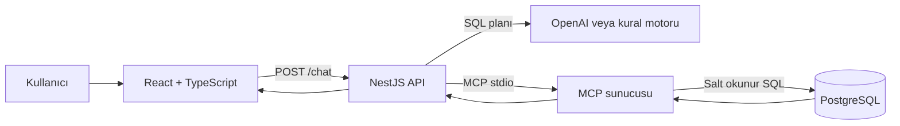
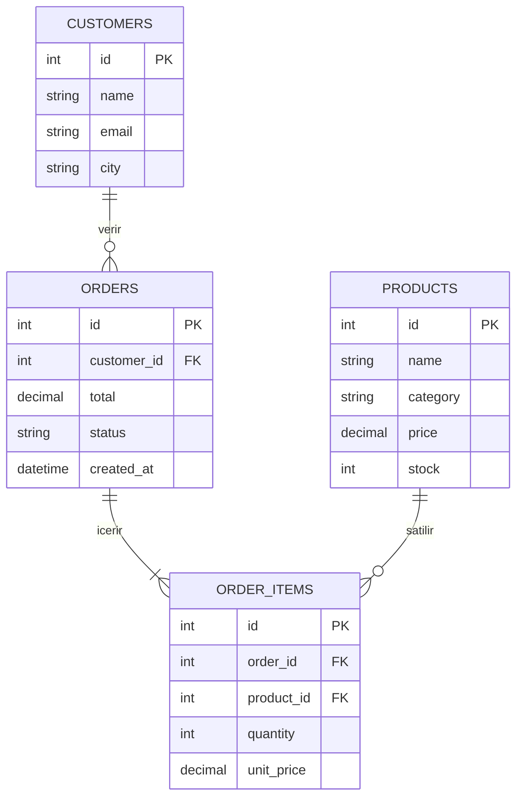

# Sistem Mimarisi

## Bileşen sorumlulukları

| Katman | Sorumluluk |
| --- | --- |
| React | Soruyu alma, bağlantı durumunu gösterme, geçmişi cihazda saklama, SQL ve tablo sonucunu sunma |
| NestJS | Girdi doğrulama, soru planlama, MCP istemciliği, hata yönetimi, Swagger |
| OpenAI / kural motoru | Doğal dil sorusundan güvenli SQL planı üretme |
| MCP sunucusu | Araç sözleşmesi, SQL güvenlik kontrolü, sorgu sınırları ve PostgreSQL erişimi |
| PostgreSQL | Ürün, müşteri, sipariş ve sipariş kalemi verilerini saklama |

## Veritabanı ilişkileri

## Güvenlik katmanları

1. DTO doğrulaması soruyu 2–500 karakterle sınırlar.
2. Model yalnızca izin verilen şemayı görür ve Structured Outputs ile plan döndürür.
3. MCP yalnızca `SELECT` veya `WITH` ile başlayan tek statement kabul eder.
4. Yorumlar, veri değiştiren anahtar kelimeler, satır kilitleri ve sistem katalogları reddedilir.
5. PostgreSQL bağlantısı `chatbot_reader` isimli yalnızca-okuma kullanıcısıyla kurulur.
6. Sorgu read-only transaction içinde, 5 saniye zaman aşımıyla çalışır.
7. Sorgu bir alt sorgu olarak sarılır ve sonuç en fazla 50 satır olur.
